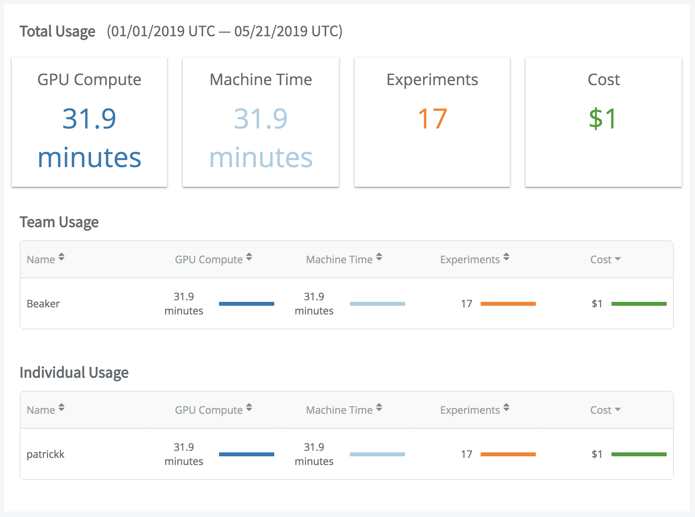

# Reporting

Review and sort usage metrics.

## Show reports

Specify a specific date range or a month, quarter, or yearly time period for any or all teams.

## Metrics

Measure costs, GPU compute, machine time, or experiments.

