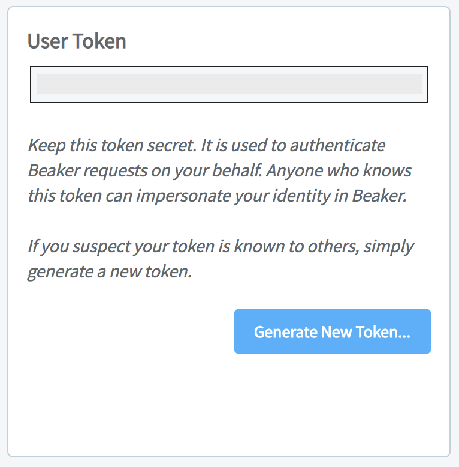

# Settings

## User Details

To edit details such as **Name** or **Institution**, click the pencil icon next to the item and enter a new value.

**Note:** You can also see your unique **ID** in this box.

## User Token

To get or change your secret authentication token, click **Generate User Token**.

## Comet.ml

Link your [Comet.ml](https://www.comet.ml) username to Beaker, or [create an account](https://github.com/beaker/comet-guide/blob/master/README.md) by enabling Comet in your Beaker spec. 

## Beaker CLI

Install, configure, and test the [Beaker CLI](../cli.md) by following the instructions in **Settings**.

