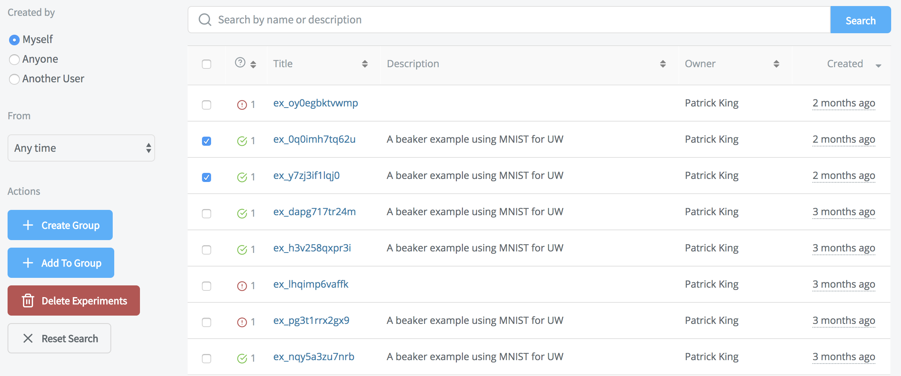
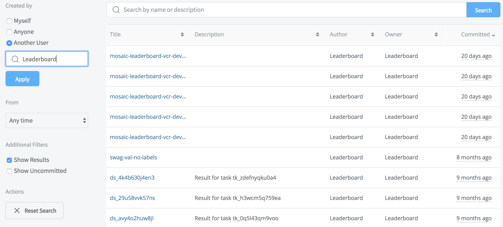
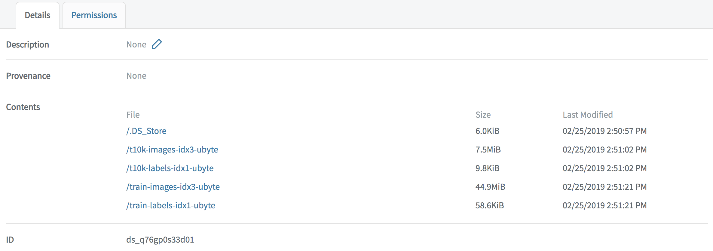

# Beaker Site

## Experiments

Search and sort experiments by yourself, others, or by a specified timeframe.

### Actions

Select experiments in the list, then choose:

* **Create Group** to group them and provide a description
* **Add To Group** if a group already exists
* **Delete Experiments** to remove them from the system
* **Reset Search** to clear the current search filter

## Datasets

## Experiments

Search and sort datasets of your or others' experiments, or by a specified timeframe. You can also filter to **Show Results** or **Show Uncommitted** datasets.

### Actions

* **Reset Search** to clear the current search filter

### Dataset Details

Select a dataset to show its **Description**, **Provenance**, **Contents**, and **ID**.

You can also click **Permissions** to change a dataset's default:  **None** or **Read**.

## Groups

To get or change your secret authentication token, click **Generate User Token**.

## Organizations

To get or change your secret authentication token, click **Generate User Token**.
